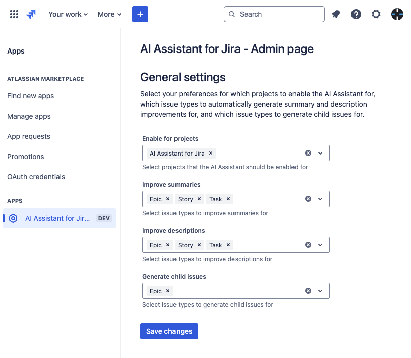

# AI Assistant for Jira
AI Assistant for Jira is a Forge app that revolutionizes issue management by automatically refining summaries and descriptions using cutting-edge generative AI, ensuring every issue is crystal clear, concise, and actionable.

## Overview
AI Assistant for Jira is designed to stay out of your way and help you save time. It improves the quality of your issues while you focus on the big picture.

The AI Assistant listens to issue creation events and uses AI to automatically refine issue summaries and descriptions, making them concise and clear. It defines a Minimum Viable Product for the issue and adds Acceptance critera to enhance the description. For the sake of traceability and clarity, it justifies the changes it made by posting a comment on the issue.

AI Assistant for Jira can also generate child issues for selected issue types, breaking down the parent issue into smaller, more manageable child issues.

## Configuration
You configure the AI Assistant on the General settings admin page. You need to have Administrator role to be able to access the admin page and configure the AI Assistant.

Here you can select the projects you want to enable the AI Assistant for, the issue types you want to automatically improve summaries and descriptions for, and the issue types you want to generate child issues for.

### Follow the below steps to configure AI Assistant

- Step 1: Go to the General settings admin page.
- Step 2: Select the projects you want to enable the AI Assistant for.
- Step 3: Select the issue types you want to automatically improve summaries and descriptions for.
- Step 4: Select the issue types you want to generate child issues for.
- Step 4: Click on the "Save changes" button to save the configuration.

## Usage
Once you have configured the AI Assistant, it will start watching the selected projects for new issues, and automatically update the issues with refined summaries and descriptions.

All you and your team members need to do is to create new issues.

When child issue generation is enabled, the AI Assistant will generate child issues for the selected issue types.

For each refined issue, the AI Assistant for Jira will also update the issues' comments with a justification of the improvements made.

